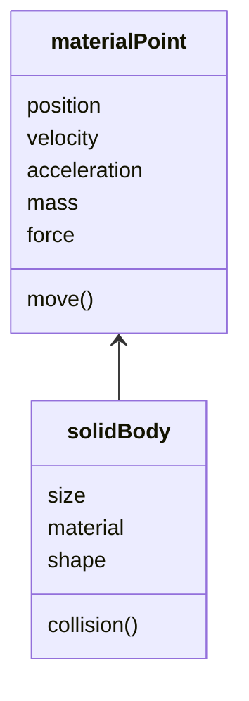

# ...

A module i made to better understand physics

---

Environment

- Variables
  - Gravity
  - Temperature

Bodies

- Variables
  - Acceleration
  - Mass
  - Velocity
  - Position
  - Force
  - Size
- Actions
  - Move
  - Collide
  - Change state

## Diagram

